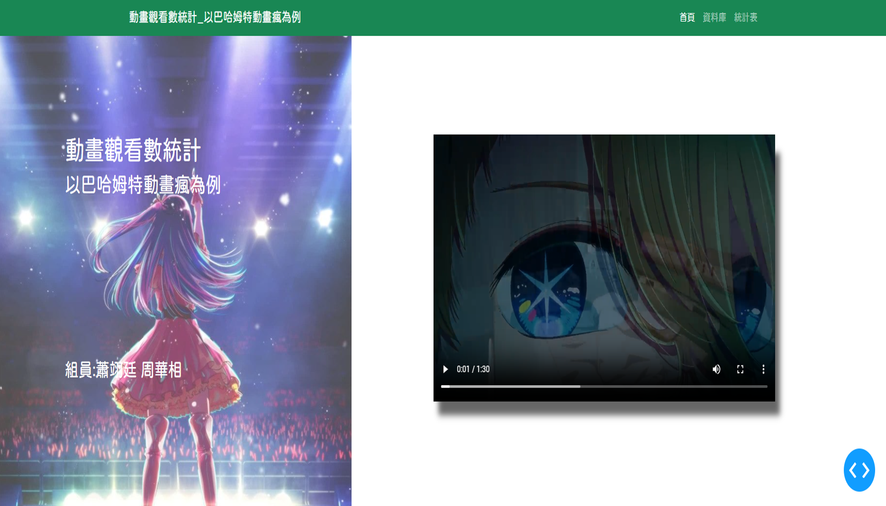
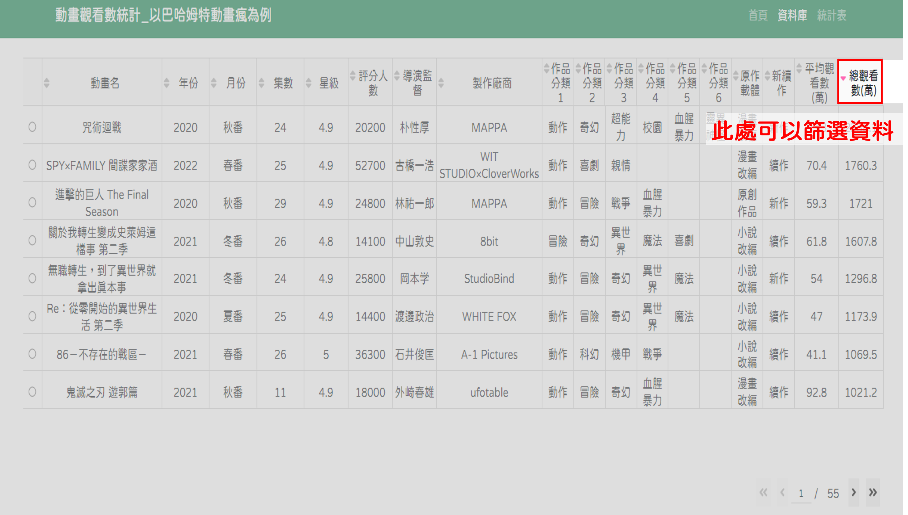
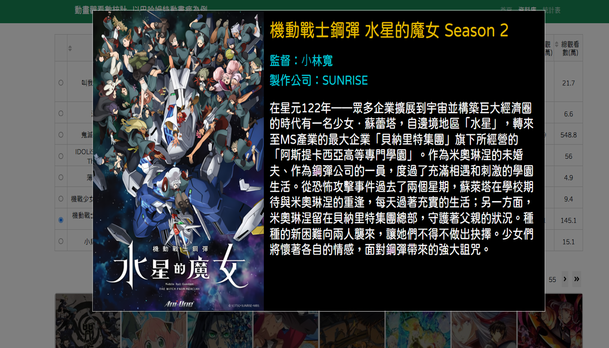
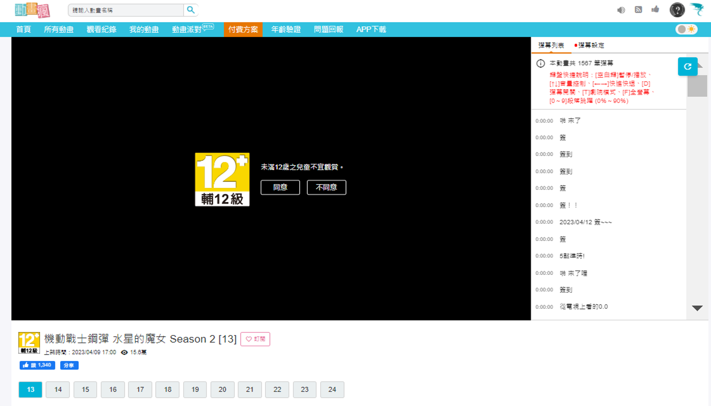
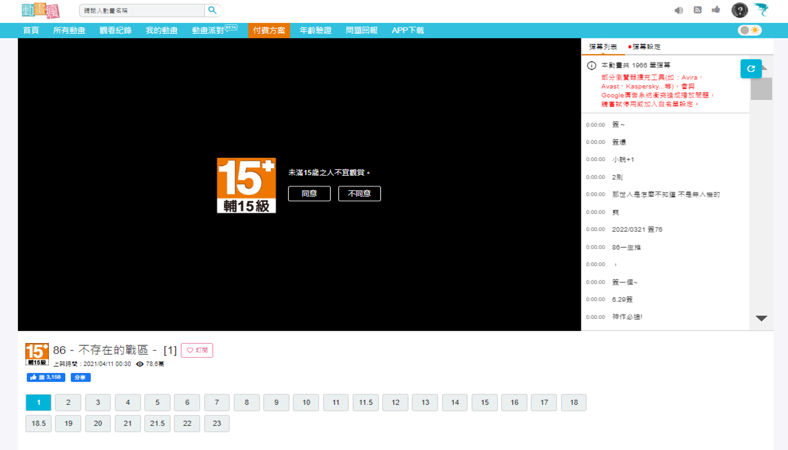
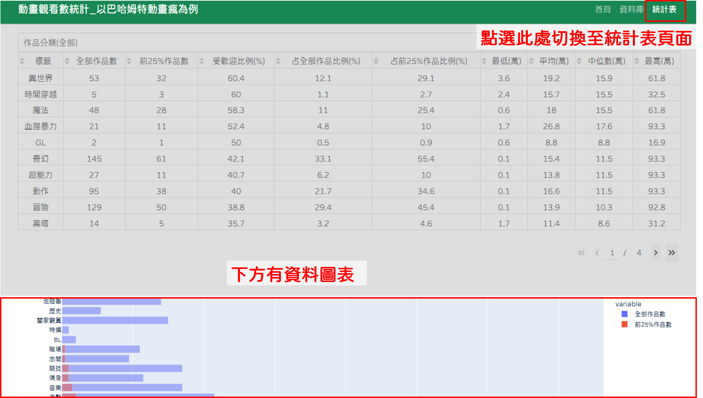
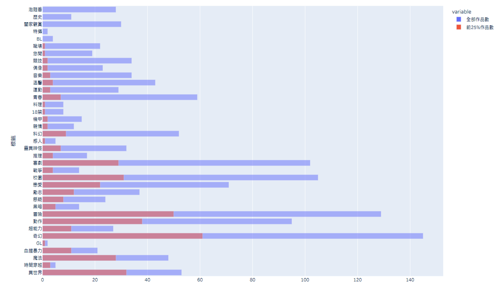
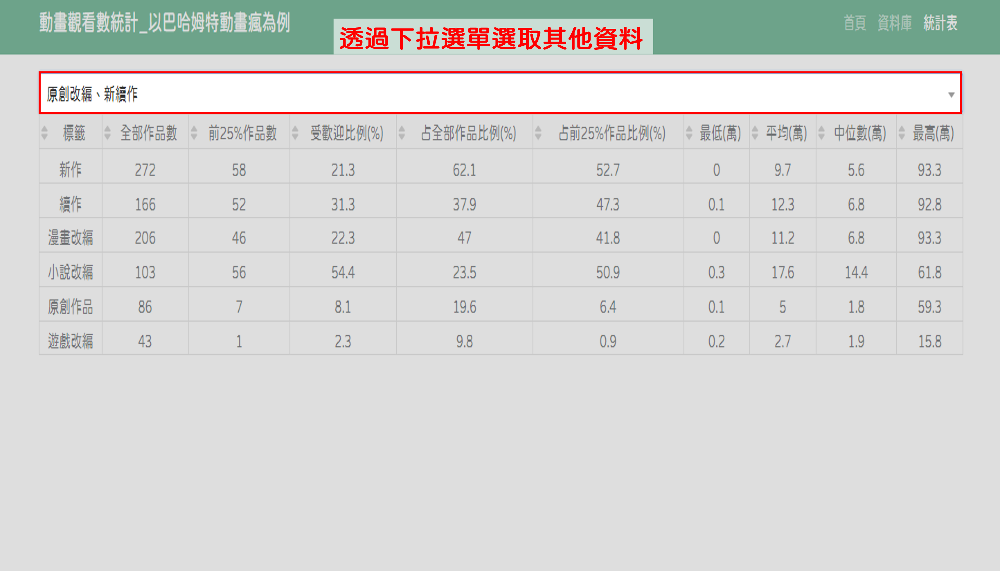
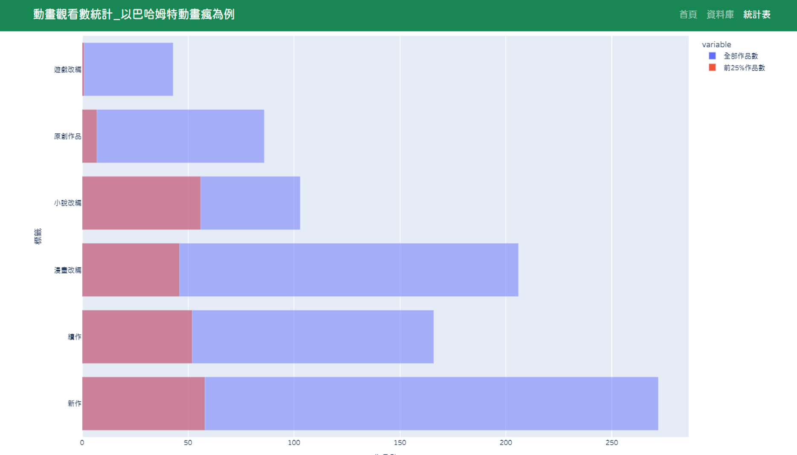
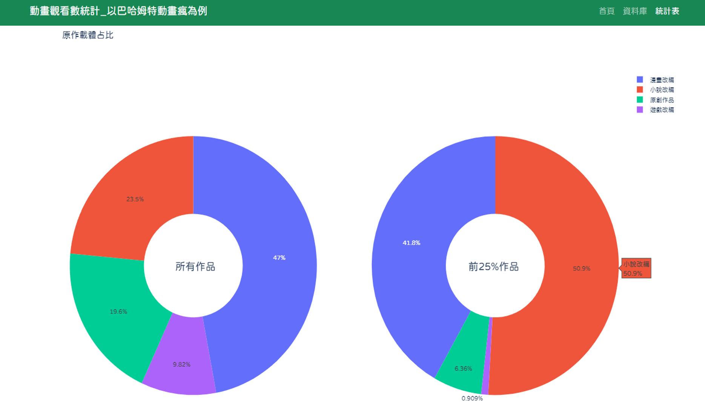

# 動畫觀看數統計_以巴哈姆特動畫瘋為例

## 初始畫面

## 資料庫頁面

## 外部連結至該動畫

## 外部連結至新作介紹

## 統計表頁面

### 一、專案組名：動畫觀看數統計
### 二、專案組員：蕭翊廷、周華相
### 三、專案網址：
- https://github.com/spread11-afk/Car_Accident_Reparaion_Visualization/tree/main

### 四、專案目的：動畫觀看數統計
1. 使用時機：
   - 民眾發生車禍案件時，可參考法院判決預估和解金額，作為和解談判之依據。
   - 視覺化呈現過往判決中賠償金額之分佈。
2. 程式集：CarAccident.py
### 五、資料說明：
1. 巴哈姆特動畫平台https://ani.gamer.com.tw/

2. 資料篩選: 
   - 以「裁判書」為篩選條件，下載自202201~202307之所有案件。
   - 以判決字號篩選交通事件。
   - 以正規則表示法，去除裁定等非實體判決之訴訟事件。
3. 資料範圍：
   - 202001~202304之所有在巴哈姆特的動畫。